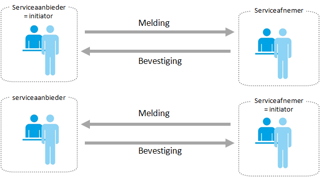
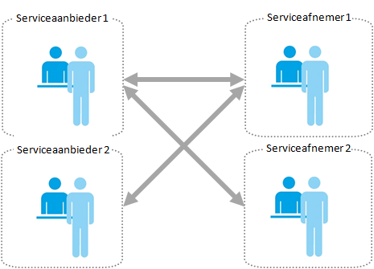
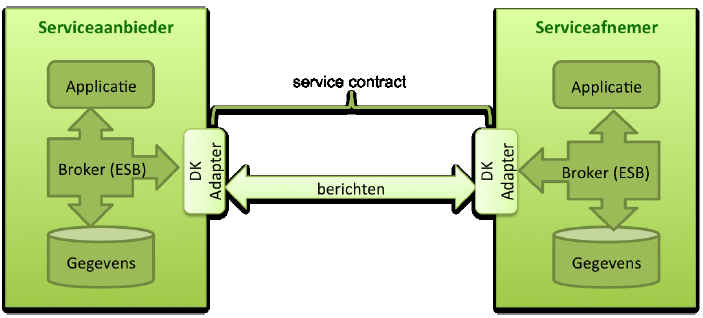
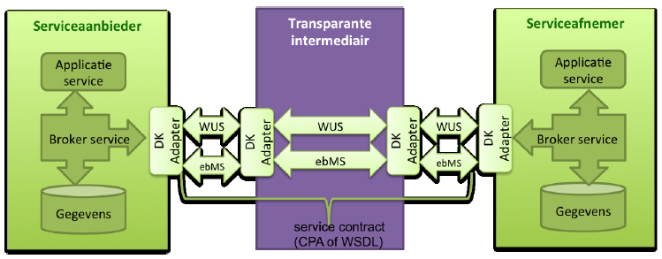

# Werking van Digikoppeling?

## Welke vormen van berichtuitwisseling zijn er?

Digikoppeling onderscheidt twee hoofdvormen van uitwisseling, te weten bevragingen en meldingen.

### Bevragingen

Betreft het stellen van een vraag en vervolgens het ontvangen van een antwoord. Een serviceafnemer4 is de initiator van een bevraging. Zie Figuur 4.

4: Een partij kan een service aanbieden – in de rol van serviceaanbieder – of een service afnemen – in de rol van serviceafnemer.

Voorbeeld in een dagelijkse situatie: Het opvragen van het banksaldo via internetbankieren is een bevraging. De bank zal na ontvangst van de vraag om het saldo van de rekening in te zien een antwoord teruggeven.

Bevragingen worden ingericht op basis van de Digikoppeling-koppelvlakstandaard WUS. Partijen hanteren dezelfde koppelvlakstandaard (WUS). Voor een bevraging is vereist dat de service op het moment van bevraging beschikbaar is. Er is sprake van een “best effort” want een antwoord op een bevraging kan bewust of om technische redenen niet altijd plaatsvinden. Bevragingen kunnen rechtstreeks of via een intermediair verlopen. Meer informatie, zie §5.3.

### Meldingen

Betreft het verzenden van een bericht naar een ontvanger waarbij het essentieel is te weten dat het bericht goed ontvangen is middels een bevestiging. Zowel een serviceaanbieder5 als een serviceafnemer kunnen initiator zijn van een melding. Meldingen kunnen rechtstreeks of via een intermediair verlopen. Zie Figuur 5.

5: Een partij kan een service aanbieden – in de rol van serviceaanbieder – of een service afnemen – in de rol van serviceafnemer.

Voorbeeld in een dagelijkse situatie: Bij de bank wordt een bedrag bijgeboekt op de eigen rekening. De transactie die heeft plaatsgevonden wordt aan de betrokken rekeninghouders teruggekoppeld met een melding over de bijschrijving en een melding aan de andere rekeninghouder over de afboeking. Hier is sprake van een “reliable message” want er kan nooit een afboeking plaatsvinden zonder een bijschrijving en vice versa.

Meldingen worden ingericht op basis van de Digikoppeling-koppelvlakstandaard ebMS2.

Meer informatie over deze koppelvlakken, zie voor ebMS2 §5.2 en zie voor WUS §5.3.

### Omgaan met Grote Berichten (GB)

Berichten (Bevragingen of Meldingen) die een grootte hebben van meer dan 20 MiB6 kunnen op een andere wijze worden uitgewisseld. Hiervoor gelden specifieke afspraken. Deze zijn vastgelegd in het koppelvlakstandaard Grote Berichten. Meer informatie, zie §5.4.

6: 1 MiB=1024\^2 bytes : Voorheen stond hier 20MB. We gebruiken de term MiB om geen enkele verwarring te scheppen over de drempelwaarde. Het verschil tussen 20Mb en 20Mib is echter te verwaarlozen.

### REST API

REST API koppelingen bieden een manier van aansluiten die met name aansluit bij nieuw ontwikkelde software. Omdat een REST API koppeling ook informatie geeft over de functionaliteit wordt een REST API koppeling als laagdrempeliger ervaren dan meer traditionele SOAP koppelvlakken. Een govolg van het REST principe is wel dat het koppelvlak in principe vooral geschikt is voor bevragingen omdat communicatie altijd uitgaat van de serviceafnemer.

### Inhoudelijke verdieping: Bevragingen, meldingen en GB

Onderstaand kader geeft een verdere toelichting op de twee hoofdvormen van berichtuitwisseling (bevragingen en meldingen) en het omgaan met grote berichten. Het is opgesteld vanuit een technisch perspectief.

Doelgroep van dit kader is gericht op medewerkers die een taak hebben in het analyseren en ontwerpen (design) [A&D] danwel het ontwikkelen, testen en beheren [OT&B].

#### Bevragingen

Een vraag-antwoord (“request-response”) noemen we een bevraging. De vragende partij stuurt een voorgedefinieerde vraag (request) aan de serviceaanbieder, die een antwoord (response) verstrekt. Het initiatief ligt bij de serviceafnemer.

Digikoppeling-bevragingen zijn synchroon: het vragende informatiesysteem wacht op een antwoord. Dit wachten heeft een beperkte duur (time-out). Als een (tijdig) antwoord uitblijft moet de vrager besluiten of hij de vraag opnieuw stelt of niet. De snelheid van afleveren is hier vaak belangrijker dan een betrouwbare aflevering.

#### Meldingen en mutaties
Betrouwbare berichten (”reliable messaging”) noemen we een melding. Bij betrouwbare berichten (melding) verstuurt de verzender een betrouwbaar bericht (melding) naar de ontvangende partij (ontvanger) en wacht op een ontvangstbevestiging.

Een melding is een enkelvoudig bericht. Het gebruikte protocol regelt de betrouwbare ontvangst en de onweerlegbaarheid (non-repudiation) van een bericht. Bij meldingen is de betrouwbare aflevering van het bericht essentieel. Als een partij het bericht niet direct kan aannemen, voorzien de protocollen erin dat het bericht nogmaals wordt aangeboden.

#### Grote berichten (GB)

De situatie kan zich voordoen dat een bericht een omvang krijgt die niet meer efficiënt door de Digikoppeling-adapters of achterliggende systemen verwerkt kan worden, bijvoorbeeld vanwege de overhead bij eventuele hertransmissies. Ook kan het voorkomen dat er behoefte bestaat aan het sturen van aanvullende informatie naar systemen buiten de normale procesgang ('out-of-band'). In die gevallen zal dit grote bestand op een andere wijze uitgewisseld moeten worden: middels de Digikoppeling Koppelvlakstandaard Grote Berichten.

Bij ‘grote berichten’ worden grotere bestanden uitgewisseld via een melding of een bevraging in combinatie met een (HTTPS-)download vanaf een beveiligde website. Grote berichten vormen een functionele uitbreiding op bevragingen en meldingen voor de veilige bestandsoverdracht van berichten groter dan 20 MiB.

Digikoppeling Grote Berichten kent verschillende toepassingsvormen. De best-practice, in een apart document, beschrijft de volgende vormen:

- Upload – grote hoeveelheid gegevens uploaden.

- Download – grote hoeveelheid gegevens downloaden.

- Selectie – een selectie van grote hoeveelheden gegevens verkrijgen.

- Verzending – grote hoeveelheid gegevens versturen.

- Multi-distributie – grote hoeveelheid gegevens aan meerdere ontvangers versturen.

| **Meer informatie** | **Zie document in aansluitkit** | **Doelgroep** |
|---|---|---|
| Inhoudelijke beschrijving KVS WUS (huidige standaard) | Digikoppeling_\_Koppelvlakstandaard_WUS | [A&D]  [OT&B] |
| Inhoudelijke beschrijving KVS ebMS2 | Digikoppeling_Koppelvlakstandaard\_ebMS2 | |
| Inhoudelijke beschrijving KVS GB | Digikoppeling_Koppelvlakstandaard \_Grote_Berichten | |

## Inleiding koppelvlakstandaard REST API

_TODO: nog toe te voegen_

### Achtergrond: API Standaarden

Koppelvlakken volgens REST API principes zijn ontwikkeld vanuit de idee dat interactie tussen appliacties eenvoudiger moest kunnen. De voorgaande koppelvlakstandaarden werden als te uitgebreid en restrictief ervaren. REST API koppelvlakken zijn een poging om met een grisse blik naar interactie tussen applicaties te kijken.

REST staat voor _representational state transfer_. REST is geen standaard maar een ontwerpprincipe, en laat nog veel vrijheid in het structureren van API's. In REST is een applicatie te bevragen als _resource_ via een URI. De status van het resource (en wat je bij een bevraging terugkrijgt) is de _resource representation_. Een belangrijk principe van REST is dat de bevraging _stateless_ is. Op een vraag komt een antwoord en daarmee is de transactie afgesloten. Een applicatie kan niet op eigen initiatief berichten naar een gebruiker sturen. Ieder antwoord is het gevolg van een vraag van een gebruiker.

### Grote berichten ondersteund door standaard

In de WUS en ebMS koppelvlakken is de grootte van een bericht beperkt. Daarom is voor di koppelvlakken een aanvullend koppelvlak nodig voor grote berichten

## Inleiding koppelvlakstandaard ebMS2

### Achtergrond: ebMS familie van standaarden

Digikoppeling maakt gebruik van een familie van standaarden die we “ebMS2” noemen. Deze familie van standaarden is gebaseerd op web-service standaarden uit de profielen van de OASIS “ebXML Messaging Services“ Technical Committie (ebMS).

Kenmerkend voor de ebMS2-standaarden die voortkomen uit de EDIFACT-wereld is de 1-op-1 relatie tussen een beperkt aantal (vaak twee) partijen. Dit betekent dat twee partijen samen een CPA7 moeten afspreken, creëren en implementeren; de CPA is dus van zowel de serviceaanbieder als de serviceafnemer.

7: Collaboration Protocol Agreement: Servicecontract voor ebMS services.

### ebMS2 voor meldingen

De Digikoppeling koppelvlakstandaard ebMS2 (KVS ebMS2) ondersteunt het uitvoeren van meldingen8 tussen geautomatiseerde informatiesystemen. Het protocol regelt de betrouwbare ontvangst van een bericht en eventueel de onweerlegbaarheid (non-repudiation) in de vorm van een ondertekende ontvangstbevestiging. Hoewel Digikoppeling-meldingen (op de logistieke laag) asynchroon9 zijn kan de business-laag wel synchroon10 werken als de verzender wacht op een retour-melding.

8: Berichten waar meestal niet direct een antwoord valt te geven, ofwel asynchroon berichtenverkeer. De ontvanger krijgt eerst een bevestiging dat zijn bericht ontvangen is. Later volgt het uiteindelijke antwoord.

9: Er komt geen onmiddellijke reactie, of deze ontbreekt volledig.

10: Er volgt een onmiddellijke reactie op het verzoek.

De KVS ebMS2 regelt de volgende functionaliteiten voor meldingen:

- Identificatie en authenticatie11 van partijen,

- Versleutelen van transport,

- Adresseringsinformatie voor routering ‘achter de voordeur’,

- Routeren via message-handlers,

- Asynchroon berichten correleren12 d.m.v. message ID,

- Meerdere berichten logisch samenvoegen,

- Berichten voorzien van een beveiligde datum en tijd-stempel (time-stamping),

- Berichtuitwisseling vast leggen in standaard technisch contract formaat (servicecontract),

- Beveiligen van berichten d.m.v. technische handtekening,

- Beveiligen van berichten door de content te versleutelen,

- Onweerlegbaarheid13 op protocolniveau (non-repudiation),

- Betrouwbaar asynchroon berichten versturen met ontvangstbevestigingen,

- Ondersteuning voor foutafhandeling op asynchrone berichten,

- Volgorde van berichten zo mogelijk handhaven,

- Hertransmissies op protocolniveau totdat ontvangst is bevestigd.

11: Het herkennen van een identiteit van een partij binnen Digikoppeling vindt plaats op basis van een PKIoverheid-certificaat en een uniek identificatienummer.

12: Proceskoppeling zonder onmiddellijke reactie (maar mogelijk wel later).

13: Achteraf kan niet ontkend worden dat een bericht is verstuurd of dat een bericht in goede orde is ontvangen.

### CPA voor vastleggen gegevensuitwisseling

Een CPA is een formeel xml-document om de gebruikte functionele en technische eigenschappen van de ebMS2 protocol-karakteristieken vast te leggen. Het is dus een formele beschrijving voor het uniform instellen van de gegevensuitwisseling. Een CPA moet worden gecreëerd als twee partijen afspreken om van elkaars ebMS2 services gebruik te maken. Beide partijen moeten de CPA importeren in hun Digikoppeling-adapter om deze te configureren voor de berichtuitwisseling. De wijze waarop een CPA wordt toegepast staat beschreven in Digikoppeling Best Practices ebMS2. Het CPA register ondersteunt partijen in het creëren van een CPA.

### ebMS2 voor vragen met een uitgesteld antwoord

In sommige sectoren wordt een vraag verstuurd met ebMS2 en komt het (uitgestelde) antwoord ook via ebMS2 retour. Deze vorm van uitwisseling is asynchroon en voldoet dus niet aan de definitie voor bevragingen, omdat een bevraging synchroon is. Digikoppeling biedt hiervoor meldingen (ook ingeval van WUS). Bij dit type gebruik is de betrouwbaarheid eigenlijk overbodig. Het ebMS2 best effort profiel van de koppelvlakstandaard ebMS2 kan ook voor dit type vragen met uitgestelde antwoorden worden gebruikt, als partijen dit onderling afspreken. Dit gebruik wordt niet op landelijk of intersectoraal niveau toegestaan en is dus uitsluitend optioneel binnen sectoren.

| **Meer informatie over:** | **Zie document in de aansluitkit:** | **Doelgroep:** |
|---|---|---|
| Inhoudelijke beschrijving KVS ebMS2 | Digikoppeling_Koppelvlakstandaard\_ebMS2 | [A&D] [OT&B] |
| Best practices ebMS2 | Digikoppeling_Best_Practices\_ebMS2 | [OT&B] |
| Handleiding CPA register | CPA\_register | [A&D] [OT&B] |

## Inleiding koppelvlakstandaard WUS

### Achtergrond: WUS familie van standaarden

Digikoppeling maakt gebruik van een familie van standaarden die we binnen Digikoppeling de naam “WUS” geven. Deze familie van standaarden is gebaseerd op web-service standaarden uit de profielen van de OASIS “Web Services – Basic Reliable and Secure Profiles” Technical Committie (WS-BRSP). De naam WUS staat voor WSDL, UDDI en SOAP, drie belangrijke deelstandaarden. Hoewel Digikoppeling geen gebruik van UDDI maakt is deze term inmiddels gebruikelijk.

Kenmerkend voor de WUS-standaarden die voortkomen uit de Internet-wereld is de 1-op-n relatie tussen service aanbieder en meerdere service afnemers. Dit betekent bijvoorbeeld dat een WUS service één WSDL heeft die door alle afnemers kan worden gebruikt.

### WUS voor bevragingen

De Digikoppeling-koppelvlakstandaard WUS (KVS WUS) ondersteunt het uitvoeren van bevragingen14 tussen geautomatiseerde informatiesystemen. De KVS WUS biedt de volgende functionaliteiten voor bevragingen:

14: Vragen waar direct een reactie op wordt verwacht, ofwel synchroon berichtenverkeer. Hierbij is de snelheid van afleveren belangrijk. Als een service niet beschikbaar is, krijgt de verzender een foutmelding en moet hij later of op een andere manier de informatie opvragen.

- Identificatie en authenticatie van partijen,

- Versleutelen van transport,

- Adresseringsinformatie voor routering ‘achter de voordeur’,

- Routeren via message-handlers,

- Berichtuitwisseling vast leggen in standaard technisch contract formaat,

- Beveiligen van berichten d.m.v. technische handtekening,

- Beveiligen van berichten door de content te versleutelen,

- Foutmeldingen.

### WSDL

Een WSDL is een formeel xml-document om de gebruikte functionele en technische eigenschappen van de berichtuitwisseling via WUS vast te leggen. Elke service heeft één WSDL, die door de serviceaanbieder wordt opgesteld. Deze is door alle afnemers te gebruiken. Door importeren van de WSDL in de Digikoppeling-adapter van een afnemer wordt de berichtuitwisseling geconfigureerd.

De wijze waarop een WSDL wordt toegepast staat beschreven in Digikoppeling Best Practices WUS.

| **Meer informatie over:** | **Zie document in de aansluitkit:** | **Doelgroep:** |
|---|---|---|
| Inhoudelijke beschrijving KVS WUS Digikoppeling (huidige standaard) | Digikoppeling_Koppelvlakstandaard_WUS  | [A&D] [OT&B] |
| Best practices Digikoppeling WUS | Digikoppeling_Best_Practices_WUS | [OT&B] |

## Inleiding koppelvlakstandaard Grote berichten

### Werking grote berichten

De situatie kan zich voordoen dat een WUS en/of ebMS2 bericht een grootte krijgt die niet meer efficiënt door de WUS / ebMS2 adapters verwerkt kan worden. Ook kan het zich voordoen dat er behoefte bestaat aan het buiten de normale procesgang ('out-of-band') sturen van aanvullende informatie naar systemen. In die gevallen zal dit “grote bericht” op een andere wijze verstuurd moeten worden: middels de Digikoppeling-koppelvlakstandaard Grote Berichten.

De volgende standaard aanpak wordt hierbij gehanteerd:

- Met WUS of ebMS2 wordt een referentie (link) verstuurd,

- De referentie wordt gebruikt om een groot bestand te downloaden.

Het grote bericht zelf zal vaak volledig in het grote bestand zijn opgenomen; het WUS of ebMS2 bericht bevat dan alleen metadata (waaronder de link naar het bestand). Maar het kan ook gebeuren dat een klein deel van het oorspronkelijk grote bericht al in het WUS-bericht is opgenomen en de rest (bijvoorbeeld bijlagen bij het bericht) in een of meerdere bestanden is opgenomen.

Het principe dat Digikoppeling grote berichten toepast is het ‘claim-check’ principe. Dit betekent dat het bericht zelf (WUS of ebMS2) alleen een referentie (claim-check) naar het grote bestand bevat. Deze referentie wordt vervolgens gebruikt om het bestand zelf op te halen.

Een belangrijk voordeel hiervan is dat het grootste deel (het grote bestand zelf) de berichtenuitwisseling niet verstoort doordat het niet door de message-handler afgehandeld hoeft te worden (en deze bijvoorbeeld vertraagt). Maar ook is een voordeel dat de afhandeling van het grote deel op een ander moment in de tijd kan plaatsvinden en daardoor de procesgang van achterliggende informatiesystemen niet verstoord.

De standaard doet geen uitspraak over gegevensstromen waarin kleine en grote berichten voorkomen. Bij implementatie van dergelijke gegevensstromen zal een organisatie moeten afwegen of kleine berichten anders of gelijk aan de ‘echte’ grote berichten verwerkt worden. In z’n algemeenheid zal een uniforme afhandeling eenduidiger en vooral ook eenvoudiger zijn; slechts in bijzondere gevallen zal dit niet volstaan.

### Standaarden voor grote berichten

De Digikoppeling Koppelvlakstandaard Grote Berichten (KVS GB) maakt gebruik van WUS en ebMS2 voor het verzenden van metadata. Voor ophalen van het grote bestand maakt de standaard gebruik van HTTPS-downloads. Daardoor zijn reliability en security gelijkwaardig aan WUS en ebMS2. Ook is het gebruik van transparante intermediairs mogelijk. De KVS GB regelt de volgende functionaliteiten voor meldingen of bevragingen, in aanvulling op WUS of ebMS2:

- Identificatie en authenticatie van partijen (OIN),

- Versleutelen van transport,

- Routeren via (http) proxies,

- Bestand correleren aan bericht,

- Ondersteuning voor foutafhandeling,

- Na onderbreking hervatten waar de overdracht is afgebroken (‘resume’),

- Optioneel beperkte tijdsperiode om bestand beschikbaar te stellen.

| **Meer informatie over:** | **Zie document in de aansluitkit:** | **Doelgroep:** |
|---|---|---|
| Inhoudelijke beschrijving KVS GB | Digikoppeling_Koppelvlakstandaard_GB  | [A&D] [OT&B] |
| Best practices GB | Digikoppeling_Best_Practices_GB | [OT&B] |

## Informatiebeveiliging voor berichtuitwisseling

Als een overheidsorganisatie berichten wil uitwisselen met een andere organisatie met gebruik van Digikoppeling, zal vastgesteld moet worden of dat is toegestaan. Deze vaststelling (autorisatie) gebeurt door de aanbiedende organisatie, die dus moet weten wie informatie wil afnemen, om te kunnen bepalen of dat mag. Daartoe moet de afnemer geïdentificeerd worden, dat wil zeggen: zijn identiteit moet geverifieerd worden (authenticatie) bij de aanbieder.

Digikoppeling schrijft het gebruik van PKIoverheidcertificaten met een OIN15 voor om de identiteit van een website of server te controleren (authenticatie). Voor het opzetten van een beveiligde verbinding tussen servers en voor de ondertekening en versleuteling van berichten moet het OIN van de organisatie in de PKIoverheidcertificaten worden opgenomen. Elke overheidsorganisatie die digitaal zaken doet kan een uniek Organisatieidentificatienummer (OIN) krijgen.

15: Nadere informatie over aanvragen van een OIN en gebruik in combinatie met PKIOverheid certificaat wordt apart beschreven, zie de tabel met “meer informatie”.

Uitgangspunten en principes voor identificatie- en authenticatieafspraken zijn beschreven in het document *Identificatie en Authenticatie*. Het gaat in op de identificatie van partijen, het opzetten van een tweezijdige beveiligde TLS-verbinding en het ondertekenen en versleutelen van berichten en bijlagen. De uitgangspunten en principes zijn onafhankelijk van de te gebruiken protocolfamilie, dat wil zeggen dat ze bij ebMS2 en WUS (functioneel) gelijk zijn.

| **Meer informatie over:** | **Zie document in de aansluitkit:** | **Doelgroep:** |
|---|---|---|
| Aanvragen en gebruik OIN | Aanvragen_en_gebruik_OIN_v | [PL] [A&D] [OT&B] |
| Identificatie en Authenticatie | Digikoppeling\_Identificatie_en_Authenticatie \_ | [A&D] [OT&B] |
| Beveiligings standaarden en voorschriften | Digikoppeling_Beveiligingsstandaarden_en_voorschriften | |
| Gebruik en achtergrond certificaten | Digikoppeling\_Gebruik_en_achtergrond_certificaten | |

## Waaruit bestaat de Digikoppeling-keten?

De Digikoppeling-keten bestaat uit:

- Deelnemende publieke organisaties die gegevens met elkaar uitwisselen (partijen). Een partij kan een service aanbieden – in de rol van serviceaanbieder – of een service afnemen – in de rol van serviceafnemer.

- Intermediairs: organisaties die voor deze deelnemende organisaties bemiddelen in de uitwisseling van gegevens. Partijen maken onderling (of via een intermediair) afspraken over de inhoud en vorm van de gegevensuitwisseling.

- Componenten die de Digikoppeling-keten vormgeven.

### Partijen

Een partij is een (publieke) organisatie die gegevensdiensten via Digikoppeling aanbiedt aan andere organisaties en/of afneemt van andere organisaties. Een partij (in de rol van serviceafnemer of serviceaanbieder) is tevens het eindpunt van de Digikoppeling-keten. Partijen maken onderling of via een intermediair afspraken over de samenwerking en over de gegevensuitwisseling. De uitwisseling tussen een serviceaanbieder en een serviceafnemer moet altijd betrouwbaar / vertrouwd zijn, ondanks of dankzij de betrokkenheid van intermediairs.

### Intermediairs

Een intermediair is een organisatie die tussen twee (of meer) partijen berichten via Digikoppeling ontvangt en routeert, zie Figuur 6. Een intermediair kan dienen als sectoraal knooppunt, waarbij de intermediair meerdere partijen in een samenwerkingsverband ontzorgt en ondersteunt.

Een intermediair vormt een schakel in de Digikoppeling-keten tussen serviceaanbieder en serviceafnemer:

- Een transparante intermediair stuurt berichten door naar het eindpunt (ontvanger) zonder de berichten te bewerken. Een transparante intermediair is zelf dus geen eindpunt in Digikoppeling. Het versleutelen van berichtinhoud (berichtenniveau versleuteling) kan worden toegepast indien de intermediair niet vertrouwd wordt.

- Een niet-transparante intermediair (b.v. een sectoraal knooppunt) bewerkt berichten en is dus een eindpunt binnen Digikoppeling.

Een intermediair zoals een sectoraal knooppunt kan in opdracht van partijen inhoudelijke bewerkingen op berichten uitvoeren zoals de integratie, conversie en distributie van gegevens. Een dergelijke ondersteunende rol kan partijen ontzorgen bij de implementatie van standaarden, het beheer van gedeelde / gezamenlijke voorzieningen en de afstemming tussen partijen op het gebied van gegevensuitwisseling.

### Componenten in de logistieke Digikoppeling-keten

Op een hoog abstractieniveau maken de volgende componenten onderdeel uit van de Digikoppeling-keten van berichtuitwisseling.

| **Componenten** | **Toelichting** |
|---|---|
| Applicatie | Een systeem waarmee gegevens worden geproduceerd, vastgelegd en gebruikt. En berichten worden gegenereerd en/of geïnterpreteerd. |
| Broker of Enterprise Servicebus (ESB) | Een component waarmee berichten worden aangeboden, afgenomen, gemonitord en verwerkt. Dit type systeem wordt gebruikt in de integratielaag. Een ESB, broker of message handler zijn voorbeelden van een dergelijke component.Een broker of ESB is een veelgebruikte component, maar niet per se een standaard component. |
| Digikoppeling-adapter | Een software-adapter voor systemen die door een ICT-leverancier wordt geleverd en die de Digikoppeling-koppelvlakstandaarden implementeert. De Digikoppeling-adapter handelt alle aspecten van de berichtverwerking af, inclusief de versleuteling/ontsleuteling, ondertekening etc. Een broker of ESB voorziet vaak in de basis van een (configureerbare) Digikoppeling adapter.  |
| Gegevens | Informatie die wordt beheerd en opgeslagen. Gegevens worden voor een specifieke uitwisseling in een bericht geplaatst. |
| PKIoverheid certificaten | Identificatie en authenticatie vindt plaats op basis van het PKIoverheidscertificaat. Zie voor nadere uitleg de documenten “Digikoppeling Identificatie en Authenticatie” en “Achtergrond en gebruik van Digikoppeling certificaten. |
| Servicecontract | Een technisch formaat voor het vastleggen van afspraken over de inhoud van de gegevensuitwisseling tussen partijen. Een servicecontract wordt vormgegeven d.m.v. een CPA16 (voor ebMS2) en een WSDL17 (voor WUS) en wordt ingelezen in de Digikoppeling-adapter. Partijen stellen samen een servicecontract op. |

16: Collaboration Protocol Agreement: Servicecontract voor ebMS services.

17: Servicecontract voor WUS services.

Tabel 3: Componenten van de Digikoppeling-keten.  
In het document “Voorbeelden van generieke inrichtingen met Digikoppeling” worden een aantal varianten van inrichtingen met bovenstaande componenten weergegeven.

| **Meer informatie** | **Zie document in aansluitkit** | **Doelgroep** |
|---|---|---|
| Voorbeelden van generieke inrichtingen met Digikoppeling | Digikoppeling\_Voorbeelden_generieke_inrichtingen  | [PL] [A&D]  [OT&B] |

## Hoe ziet de berichtuitwisseling-dialoog eruit voor bevragingen en meldingen?

De berichtuitwisseling tussen betrokken partijen kent de volgende mogelijkheden:

- Bilaterale uitwisseling tussen partijen.

- Bilaterale uitwisseling via een transparante intermediair

    De mogelijkheden worden hieronder toegelicht. Daarbij zijn de componenten in de Digikoppeling-keten en hun samenhang op abstract niveau weergegeven.

### Bilaterale uitwisseling tussen partijen

In het eenvoudigste ‘patroon’ gebruiken de serviceaanbieder en serviceafnemer Digikoppeling rechtstreeks voor bevragingen of meldingen, eventueel in combinatie met grote berichten. Partijen stellen samen een (technisch) servicecontract op dat ingelezen kan worden in de eigen Digikoppeling-adapter. Zie Figuur 7.

### Bilaterale uitwisseling via een transparante intermediair

Een transparante keten18 is alleen mogelijk als zowel de serviceaanbieder als de serviceafnemer hetzelfde protocol hanteren. De intermediair routeert berichten tussen de serviceaanbieder en de serviceafnemer waarbij het bericht intact blijft (alleen de ‘header’, ofwel adresregel op de envelop, wordt gelezen). De uitwisseling verloopt op dezelfde manier als bij een bilaterale uitwisseling. Zie Figuur 8.

18: Zonder wijziging aan berichten.

